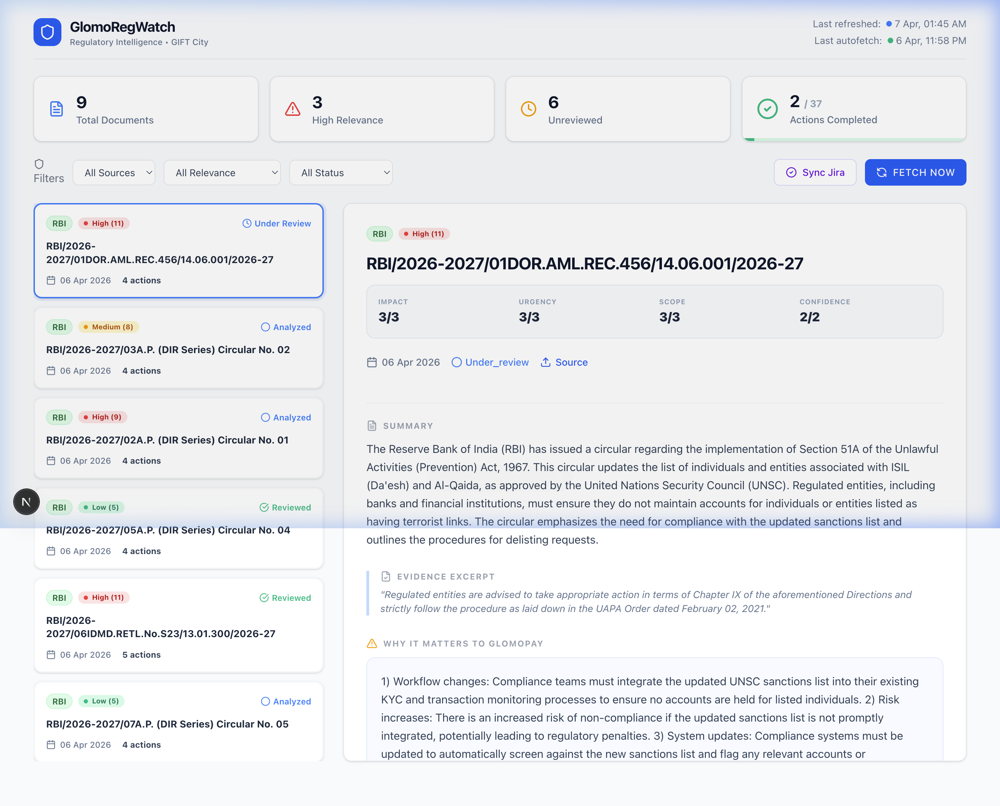

<div align="center">
  
  <h1>🛡️ GlomoRegWatch</h1>
  <p><strong>AI-Powered Regulatory Intelligence for GIFT City</strong></p>

  <p>
    <a href="https://github.com/akdPM/GlomoRegWatch"></a>
    
    
    
    
  </p>
</div>

---

## What is GlomoRegWatch?

GlomoRegWatch is a compliance automation tool built for **Glomopay**, an IFSC-licensed cross-border remittance company in GIFT City. It automatically:

- **Scrapes** RBI & IFSCA regulatory circulars daily
- **Analyses** them with GPT-4o-mini to extract impact, urgency, scope, and action items
- **Triages** them in a compliance dashboard with a 5-stage workflow
- **Creates Jira tickets** per action item, with individual assignee selection
- **Syncs Jira status** back to the dashboard in real-time
- **Alerts** your Slack team with threaded updates

---

## 📸 Screenshots

### Triage Dashboard


---

## 🏗️ Architecture Overview

```
┌──────────────────────────────────────────────────────────────┐
│                        Next.js 15 (App Router)               │
│                                                              │
│  ┌─────────────┐   ┌──────────────┐   ┌──────────────────┐  │
│  │  /api/fetch │   │ /api/tickets │   │ /api/tickets/sync│  │
│  │  (Cron: 2AM)│   │   (Create)   │   │   (Cron: 4AM)    │  │
│  └──────┬──────┘   └──────┬───────┘   └──────────┬───────┘  │
│         │                 │                       │          │
└─────────┼─────────────────┼───────────────────────┼──────────┘
          │                 │                       │
    ┌─────▼──────┐   ┌──────▼──────┐        ┌──────▼──────┐
    │ RBI/IFSCA  │   │   Jira API  │        │   Jira API  │
    │  Scrapers  │   │  (Create)   │        │   (Poll)    │
    └─────┬──────┘   └─────────────┘        └─────────────┘
          │
    ┌─────▼──────┐
    │ OpenAI API │  ← GPT-4o-mini: summary, relevance, action items
    └─────┬──────┘
          │
    ┌─────▼──────┐
    │  Supabase  │  ← documents + action_items JSONB + activity_logs
    └─────┬──────┘
          │
    ┌─────▼──────┐
    │  Slack API │  ← Thread-based notifications per circular
    └────────────┘
```

### Status Workflow
```
📥 Fetched → 🔍 Analyzed → 👀 Under Review → 🚨 Action Required → ✅ Reviewed
```

---

## 🚀 Setup

### Prerequisites
- Node.js 18+
- A [Supabase](https://supabase.com) project
- An [OpenAI](https://platform.openai.com) API key
- A [Jira](https://www.atlassian.com/software/jira) project with API token
- A [Slack](https://slack.com) Bot token

### 1. Clone & Install

```bash
git clone https://github.com/akdPM/GlomoRegWatch.git
cd GlomoRegWatch
npm install
```

### 2. Configure Environment Variables

Copy `.env.example` to `.env.local` and fill in all values:

```bash
cp .env.example .env.local
```

### 3. Set Up the Database

Run the SQL in **Supabase → SQL Editor**:

```bash
# Copy the contents of supabase_schema.sql and run it in the Supabase SQL editor
```

### 4. Run Locally

```bash
npm run dev
```

Open [http://localhost:3000](http://localhost:3000)

---

## 🔐 Environment Variables

| Variable | Description | Required |
|---|---|---|
| `NEXT_PUBLIC_SUPABASE_URL` | Your Supabase project URL | ✅ |
| `NEXT_PUBLIC_SUPABASE_ANON_KEY` | Supabase anon/public key | ✅ |
| `SUPABASE_SERVICE_ROLE_KEY` | Supabase service role key (server-only) | ✅ |
| `OPENAI_API_KEY` | OpenAI API key for AI analysis | ✅ |
| `JIRA_BASE_URL` | Your Jira instance URL (e.g. `https://yourco.atlassian.net`) | ✅ |
| `JIRA_EMAIL` | Jira account email | ✅ |
| `JIRA_API_TOKEN` | Jira API token ([generate here](https://id.atlassian.com/manage-profile/security/api-tokens)) | ✅ |
| `JIRA_PROJECT_KEY` | Jira project key (e.g. `SCRUM`) | ✅ |
| `JIRA_EPIC_KEY` | Epic to link all tickets to (e.g. `SCRUM-1`) | Optional |
| `SLACK_BOT_TOKEN` | Slack Bot OAuth token (`xoxb-...`) | Optional |
| `SLACK_CHANNEL` | Slack channel ID to post alerts | Optional |
| `SLACK_WEBHOOK_URL` | Slack Incoming Webhook URL (legacy fallback) | Optional |

---

## 📋 Database Schema

Run `supabase_schema.sql` in your Supabase SQL Editor. Key tables:

| Table | Purpose |
|---|---|
| `documents` | Regulatory circulars with AI analysis and JSONB action items |
| `sync_logs` | History of each fetch/ingest run |
| `activity_logs` | Audit trail: who changed what status and when |

---

## ⚙️ Cron Jobs (Vercel)

Configured in `vercel.json`:

| Schedule | Endpoint | Purpose |
|---|---|---|
| Daily @ 2AM UTC | `/api/fetch` | Scrape + AI-analyse new circulars |
| Daily @ 3:30AM UTC | `/api/digest` | Send daily Slack digest |
| Daily @ 4AM UTC | `/api/tickets/sync` | Sync Jira ticket statuses |

> **Note:** Vercel Hobby plan supports daily crons only. Upgrade to Pro for sub-daily schedules.

---

## 🔗 Key Features

- **Relevance Scoring** — Impact × Urgency × Scope × Confidence matrix per circular
- **Action Item Extraction** — AI-generated tasks with owner, due date, and severity
- **Jira Assignment Modal** — Assign each action item to a real team member fetched live from Jira
- **Real-time Jira Sync** — Polls Jira API and updates per-ticket status (with strikethrough on done tasks)
- **Overdue Indicators** — Pulsing ⚠ OVERDUE badge on past-due action items
- **5-Stage Compliance Workflow** — `Fetched → Analyzed → Under Review → Action Required → Reviewed`
- **Activity Audit Log** — Timestamped log per circular showing who moved it through which stages
- **Slack Notifications** — Threaded Slack messages per circular with follow-up on review

---

## 🌐 Deployed App

> [**https://glomoregwatch.vercel.app**](https://glomoregwatch.vercel.app) ← _Update this with your Vercel URL_

---

## 🏢 Built For

**Glomopay** — IFSC-licensed cross-border remittance company, GIFT City, India.  
Monitors: RBI · IFSCA · SEBI · FATF

---

<div align="center">
  <sub>Built with Next.js 15 · Supabase · OpenAI · Jira · Slack · Vercel</sub>
</div>
